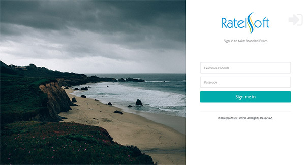
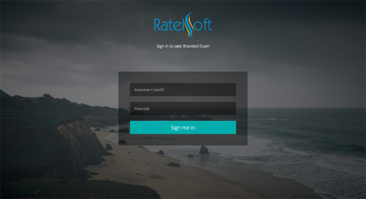
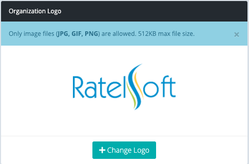
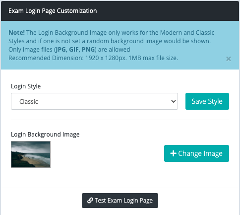

# Custom Exam Login Page

examina.io gives you the ability to change the default login page for Examinees. With this flexibility, you can add your own logo and the background image that will show up. This means you can change the look and feel whenever you want or during specific seasons to match your organization's theme. 

There are currently 3 available options to choose from:

1. The Default Style
2. The Modern Style
3. The Classic Style

*Modern Style for the Client Login Page with Custom Background Image and Logo*

*Classic Style for the Client Login Page with same Background Image and Logo*

There is an **important difference** between the Default style and the other two styles. The Default style was built to integrate seamlessly with settings from SmartExaminer thus allowing Exam branding information to be respected and shown. The Modern and Classic styles do not respect those settings and shows a preset background image and logo for the organization. 

The Designer application allows setting a branding image and branding colour for each exam which can be useful to organizations needing that much flexibility. However, branding image is restricted to a maximum size of about 650*px* x 140*px* which can be somewhat restrictive if you plan to support screens with larger real-estate.

With the Modern and Classic styles, you are not restricted based on the dimension of the image. Also, you have the option of adding a logo and a background image which you can change at anytime.

In this article we are going to focus on Modern and Classic styles and how you can configure them as the default login page style for your organization.

> Please note that this feature is only available for the **Professional, Enterprise and Flexible plans**. For other plans, you can still make use of Exam branding with the Default style.

### Setting your Organization Logo

Alright, head on to the `Settings` page. After you login, you can find the link to the page from the left side bar. 

The first thing you want to do is to set your organization logo if you've not already done that. 

You need to click on the `+Change Logo` button to select the logo image. The upload starts automatically and immediately, after you choose the image file. The file formats supported are JPG, GIF and PNG and the maximum file size for the logo is 512 Kilobytes.

> If you do not set your organization logo, The name of the organization will show up instead. If, however, you set a logo, the logo will show instead of the name of the organization.

### Changing the Style and Background Image

Still on the `Settings` page, you will find the section on **Exam Login Page Customization** and there you can make changes to the style and background image.

If you've not made changes to this setting previously, you will find that the Default style is the selected one and that a random image shows up as the Login Background Image.

Now, if you change the login style to either the Modern or Classic without setting a login background image, a random background image will be applied on the login screen. If you have added an exam from the manager, you would be able to instantly test the login page after making changes by clicking the `Test Exam Login Page` button.

> To see a large preview of the login background image, you can click on the small image preview to open an image dialog.

Clicking on the `+Change Image` button opens up your device's file chooser dialog which allows you to select the background image. If the image meets the requirements, it is automatically uploaded and changed.

One thing to note for the Classic style is that it automatically applies an image mask over the chosen background image in order to provide some reasonable contrast when inputing text in the login fields. This means your image will appear filtered on the login page with the classic style.

