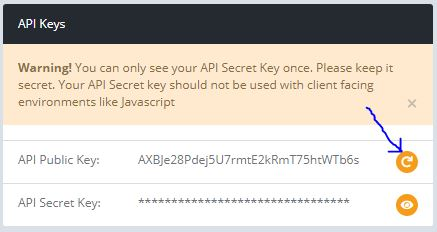
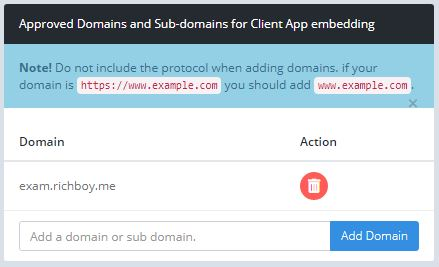
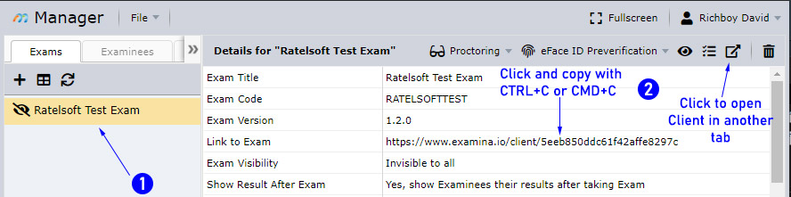

# Embedding The Client App on your Website

If you're reading this, I'm guessing you want to be able to allow your students (or examinees as we call them) to be able to take assessments directly from your website without having to send them links to [examina.io](https://www.examina.io).

Well, you're at the right place, so read on...

## Prerequisites

First, this sounds absurd trying to say this since well, you're reading this. However, it has to be said. You need your own website to get this working. Technically, you can also get this working from your own system using localhost (*more on this later*) but it may not be of much use if your plan is go get people to take assessments remotely.

Secondly, you need to know basic HTML and understand how to make little changes to a static webpage.

Thirdly, you need to have [created an account](https://www.examina.io/register) on examina.io and subscribed to a plan that supports this feature. All paid plans support this feature. So if you've not yet created an account or subscribed to a paid plan you can go ahead now and get that done first, we'll wait for you.

Done already? Oh nice, let's continue then...

## So What's Next?

Next you login to your account and go to `Settings`. You can find the link from the Side bar.

Now, for embedding the client App, you will need to do the following things:

### Create an API Public Key

If you've not already done so, you'll need to create an API public Key by clicking on the reload icon to the right as annotated below.



> &#x26a0;&#xfe0f; Note that if you change your public key, all sites using that key would need to be updated.

For simple embedding, you do not need your API secret key. You only need that when making calls to our API servers. If however, you need to auto login examinees, you will need to also generate an API secret key. More on that later.

### Approve your domain for Embedding

Next you'll need to add the domain which you'll be using to host the exams to the list of approved domains. 

To add a domain, enter the domain URL (*without the protocol part*) in the text field and click on the ***Add Domain*** button.



In my case, I am hosting the exam on `exam.richboy.me` so I added it.

You can also delete domains which you no longer want to be approved by clicking the red button with the trash icon beside the domain name.

> If you're testing locally, you can add `localhost`, `127.0.0.1` or any hostname or IP address which you normally test with and input on the address bar. **You do not need to specify the port number on the domain**.

> &#x26a0;&#xfe0f; Remember to remove all testing domains when done as they can be security risks. Due to localhost domains not being exclusive, others would also be able to embed your exams on their own testing servers if you leave them.

### Include the widget script on your webpage.

The next thing you need to do is to include the client widget javascript file on your webpage. 

This is **not** a HTML tutorial, however, I will try to keep it simple which I'm sure will be boring for advanced developers. To the advanced folks: please bear with us &#128521;.

Let's start with a simple HTML 5 webpage and we build up from there.

```html
<!DOCTYPE html>
<html>
<head>
    <meta http-equiv="Content-Type" content="text/html; charset=UTF-8">
    <title>Test Embedding examina.io client</title>
</head>
<body>
  <h1>Welcome to my Website!</h1>
</body>
</html>
```

As you might notice, there's nothing fancy about the code above. Just some dummy hello world page. Next we include the widget script tag to the `head` section as shown below:

```html
...
<head>
    <meta http-equiv="Content-Type" content="text/html; charset=UTF-8">
    <title>Test Embedding examina.io client</title>
    <script src="https://www.examina.io/client/widget.js?apiKey={YOUR_PUBLIC_API_KEY}"></script>
</head>
...
```

You need to replace `{YOUR_PUBLIC_API_KEY}` in the code above with your API Public key you generated from the [Create an API Public Key](#create-an-api-public-key) section.

> The client widget script requires your API Public Key or the script would not be loaded on the page.

The next thing you need to do is to add an anchor tag with the link to the exam and the class `examina-io-client-widget`. If Javascript is enabled on the page, the achor tag will be replaced with an iframe that loads the exam page. You can get the link to an Exam from the Manager application as show below or by using an API endpoint.



If you click to open the Exam in another tab, you can get the link from the address bar. The code snippet below shows how one may include the exam link on their website. You can design around it and apply a few more attributes which we will talk about next.

```html
...
<body>
  <h1>Ratelsoft Test Exam</h1>
  <a class="examina-io-client-widget" href="{THE_EXAM_LINK}">Go to Exam Page</a>
</body>
...
```

You should replace `{THE_EXAM_LINK}` with the exam link you copied from the Manager and that's all you'll need to embed the client app on your website.

> Note that you can only add one anchor tag for an Exam on a page with the class `examina-io-client-widget`. If there are more than one, only the first will be replaced with the widget. The others will show an error message.

### Controlling the Embedded Widget layout

Still reading on? I like your curiosity...&#128521;

So, if we just leave the widget as is, it will try to match the dimensions of the page and automatically adjust when the page is resized. That may not be for every one so if for instance you want it to be of a fixed dimension, you need to specify the `data-examina-io-height` and `data-examina-io-width` attributes on the anchor tag with the dimensions you want.

> If you only specify the dimension in one direction, the widget will automatically match the window dimension on the missing attribute's direction and adjust accordingly on resize.

> Also note that the widget will assume it has full screen control on any dimension that is unspecified and will remove all scrolling functionality from the body tag for that direction.

You can also specify negative dimensions. If you specify a negative dimension, the widget will always adjust itself to fit that window size in that dimension minus the dimension you specify. 

You can also specify the value `auto` to instruct the widget to do nothing on the dimension specified. This is important if you want to style the widget dimension your self.

As an example:

```html
...
<body>
  <h1 style="height: 50px">Ratelsoft Test Exam</h1>
  <a class="examina-io-client-widget" href="https://www.examina.io/client/5eeb850ddc61f42affe8297c" data-examina-io-height="-50" data-examina-io-width="auto">Go to Exam Page</a>
</body>
...
```

From the above, `data-examina-io-height` instructs the widget to always set it's height of the height of the window minus 50 pixels while `data-examina-io-width` instructs the widget to do nothing about the widget width even if the window resizes.

> Note that setting either value to `auto` does not imply that the widget will be sized to 0 pixels. Browsers have default sizing values for iframe and the default value from the browser will be applied if you do not style it yourself.

#### Recap for widget dimensions

So to recap,

1. If you fail to set `data-examina-io-height` or `data-examina-io-width`, the widget will take the size of the window in the direction of the attribute you did not specify as well as setting the body tag's `overflow` style to `hidden` in the missing attribute's direction. If both are not specified, the widget will match both dimensions of the screen. For any missing dimension, the widget will automatically adjust by responding to resizing events in that direction.

2. If you set a negative dimension, the widget will subtract that dimension from the size of the window and set itself to what is left from the subtraction.

3. If you set either attribute to `auto`, the widget will be set to the default size configured by the browser and would not manage the dimension for that attribute. You will have to do the management yourself.


#### Simple Embedding Example Full Snippet

```html
<!DOCTYPE html>
<html>
<head>
    <meta http-equiv="Content-Type" content="text/html; charset=UTF-8">
    <title>Testing Embedding of examina.io client</title>
    <script src="http://www.examina.io/client/widget.js?apiKey=AXBJe28Pdej5U7rmtE2kRmT75htWTb6s"></script>
</head>
<body style="display: flex; flex-direction: column; align-items: stretch;">
<div style="height: 50px; padding: 0 15px; margin: 0">Ratelsoft Test Exam</div>
<a class="examina-io-client-widget" href="https://www.examina.io/client/5eeb850ddc61f42affe8297c" data-examina-io-height="-50" data-examina-io-width="auto">Go to Exam Page</a>
</body>
</html>
```


That's all folks!


## Advanced Section (Optional)

So let's say you want to do something fancy, say you do not want the examinees to login (*again*) on the exam page before starting the exam. This can be useful if your website already has an authentication/login page which they've already gone through; it can be frustrating having to login yet again.

For this you will need your API Secret key. You can generate it from same place you generated the API Public Key. **Please keep your API Secret key safe and hidden or your data on examina.io can be compromised**.

For this example, we will use the examina.io API endpoints. I will use a simple PHP script to demonstrate this.

But First, in order to auto login a student, you will need to create a login token on examina.io for the student and for the current exam and add the token as well as other supported options to the link in the anchor tag. An example is shown below:

```html
...
<a class="examina-io-client-widget" href="https://www.examina.io/client/5eeb850ddc61f42affe8297c?autologin=true&examineeCode={CODE}&token={TOKEN}" data-examina-io-height="-50" data-examina-io-width="auto">Go to Exam Page</a>
...
```

The additional options on the anchor tag are:

1. `autologin`: This must be present with a value set to `true`.
2. `examineeCode`: The Examinee's unique code generated/specified on Manager which would normally be used to manually login.
3. `examineeId`: This can be used as a substitute for `examineeCode` and is the global unique identifier for the examinee. Only one of `examineeCode` and `examineeId` is required with `examineeCode` calling dibs if both are present.
4. `token`: The login token received from the API. 

From the snippet above, you will need to replace `{CODE}` with the Examinee's Unique Code and `{TOKEN}` with the token received from the server.

Here's a simple PHP snippet showing how to get a login token and auto login an examinee. For the examinee code, I am assuming it has been set in the sessions global variable from, maybe, the time they logged into your site.

```php
<?php
session_start();

$examineeCode = $_SESSION['examineeCode'];
$apiSecret = '{YOUR_API_SECRET_KEY}';
$apiPublic = "AXBJe28Pdej5U7rmtE2kRmT75htWTb6s";
$examId = "5eeb850ddc61f42affe8297c";   // The ID of the exam. Can be gotten from the Exam Link

// query the API to get a login token for this examinee
$ch = curl_init();
curl_setopt($ch, CURLOPT_URL, "https://www.examina.io/api/v1/login/exam/$examId/code/$examineeCode/token");
curl_setopt($ch, CURLOPT_RETURNTRANSFER, 1);
curl_setopt(
    $ch, CURLOPT_HTTPHEADER, array(
        'Authorization: Basic ' . base64_encode("api:$apiSecret")
    )
);
$response = curl_exec($ch);
curl_close($ch);

$url = '';
if ($response) {
    $result = json_decode($response, true);
    if ($result && $result['status']) {
        $token = $result['token'];
        $url = "?autologin=true&examineeCode=$examineeCode&token=$token";
    }
}
?>

<!DOCTYPE html>
<html>
<head>
    <meta http-equiv="Content-Type" content="text/html; charset=UTF-8">
    <title>Testing Embedding of examina.io client</title>
    <script src="https://www.examina.io/client/widget.js?apiKey=<?php echo $apiPublic; ?>"></script>
</head>
<body style="display: flex; flex-direction: column; align-items: stretch;">
<div style="height: 50px; padding: 0; margin: 0">Ratelsoft Test Exam</div>
<a class="examina-io-client-widget" href="https://www.examina.io/client/<?php echo $examId . $url ?>" data-examina-io-height="-50" data-examina-io-width="auto">Go to Exam Page</a>
</body>
</html>
```

Remember to replace `{YOUR_API_SECRET_KEY}` with your API Secret key. 

For more information please [visit the API docs](https://stoplight.io/p/docs/gh/ratelsoft/examina.io-api-docs).
