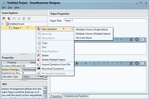

# Introducing The Designer

SmartExaminer Designer is the application responsible for building exam questions that would be ultimately used on SmartExaminer. You can regard it as the MicroSoft Word of SmartExaminer.

**The image below is the Designer interface.**

Like on most other application, the SmartExaminer's Tool Bar on which the `File` `Edit`  and `Help` are displayed, is the starting point in working with the SmartExaminer Designer.

Before we explore each of the basic active tabs, let's introduce you to the environment.

- From the image above, the blank field beneath the `Exam Explorer` is the field of display where Exams, Papers and Questions being created will be listed. 

- The next field is that of the `Properties` this field displays active Exam, Paper and Question property settings, which guides on how the questions and exam features are configured.

- The `Hint` field displays clues and information regarding some of the commands you will see as we begin to build questions, and how to work with them.

### Create an Exam Project

The very first step to building questions is to create an **Exam Project**.

1. Click on `File` 

2. From the resulting drop-down, Click on `New Exam Project`. This creates an `Untitled Exam` for you.
3. The page becomes active and ready for Exam customisation as shown below when you click on the `Untitled Exam`.

  On the Untitled Exam field, you can create Exam Papers. 
  From a school's perspective, the **Papers** can be regarded as Modules, Courses or Subjects, depending on what term it bears in your school.

### Adding Papers and Questions

  1. Right click on `UNTITLED EXAM` and the dropdown reveals options to create a 
  - `NEW EXAM PAPER` 
  - `Import Papers from File` 
  - `Export Exam to File` and a few others.

  2. Clicking on the `Paper` also activates the Paper Properties from which you can set feature preferences; it also shows the Hint.
  *note: One can create multiple papers under an exam.*
 
  3. From the Paper, you can go ahead and create `Questions` by right clicking on the `Paper` or just click the **New Question** icon under the Exam Explorer.

  

At the moment there are three question types to choose from, Other types will be coming up in subsequent updates.
The available question types are:
- Multiple Choice (single select)
- Multiple Choice (multiple select)
- Fill in the Blank

> Note: Once you have started an Exam Project on the designer, It is advisable to save that particular body of work.
> Simply click `File` and then `Save Project`