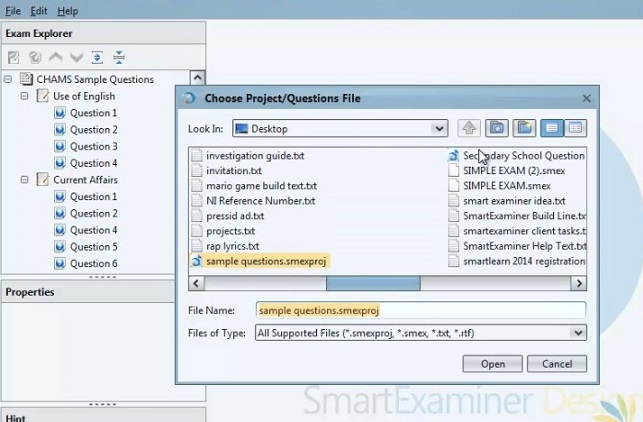
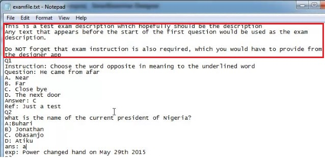

# Importing Exams, Papers and Questions
If you have gone through previous pages, you would be conversant with the terms Exam, Paper and Question by now, and how they are interlinked.

However let us refresh your mind.
The sole aim of the SmartExaminer Designer is to build questions that would be administered to examinees on the Client end as an Exam or Test. 

In creating an **EXAM** Project, you need to specify or name what **PAPER** (also called Subject, Modules or Courses) it is you are building. Several Papers or Subjects may be created in an EXAM. and obviously **QUESTIONS** are found in all the PAPERS.

So we would show you haw you can import already existing Exams, Papers and Questions below.

### Importing Exams

Kindly note that a body of Exam work is often regarded as **Project**, so to begin, 
- Open the designer and click on `File` then `Open Project`, select your choice project file from your system and import.

- In a Situation where you have other Exam Projects and you want to Merge files, 
Click on `Import Exams from a Project` then select the Project which you'd like to add then 'Open'.

- Then select The Exam Project you want to import Exam from.

  - If you open an Exam Project that contains lots of Exams, Papers and Questions as shown in the image below, you can choose to Import Multiple Exams, Papers and Questions by checking the select boxes.
  The Select All and Deselect All helps ease the stress of having to singularly selecting each box.

> Note: Imported Exams, Papers and Questions are editable. This is necessary where you wish to change the previous prevailing Property settings and Instructions.
> 

### Importing Papers
Previously, we showed how to import an Exam with Papers and Questions.
However, you can choose to import only **PAPERS**.

In this case, 
- Right click on the `EXAM` and then,
- Select `Import Paper from File`
- Go on and Select the choice file.

While trying to Import a Paper or Papers, it is possible to expand a paper as shown in the Image above, to reveal Questions.

At this point, you can Deselect or Select multiple questions. 
Likewise, you can jump to an entirely new Paper and Select Multiple Questions.
The Exam, Paper and Question Selection is quite flexible and unrestrictive.
>  Note: The major difference with adding papers from an Exam Import, is that an entirely new exam is created, while Importing papers only add new papers to an existing exam folder on the Exam Explorer field.

### Importing Questions
Here, Importing is narrowed just to **Questions** only.
To do this,
- Right click on the `Paper` which you would want the Questions to appear in,then,
- Select `Import Questions from File`
- Go on and Select the choice file.

Even though you can see saved `Exams` and `Papers` when the file is opened, selecting an Exam or Paper for import through this medium is not possible. Clicking on them only expands them to reveal the questions in them.

One can only select `Questions`, but can do that even from multiple Paper and Exam unit.

## Importing Simple Questions from Txt. file or a WordPad

You can also build simple questions on a notepad or WordPad. By simple questions, i mean questions that have no images, fractions or other complex mathematical equations.
We have created a template that can guide you with the question building for easy importing into the Designer.

In situations where you may already have simple formatting questions in other formats, You may do well to copy into a Notepad or WordPad and adapt to the given template below.

*NotePad template/ guide*

*WordPad template/ guide*

Now either of the two will serve, however we advice you use the **Wordpad**.
Its advantage over the Notepad or txt. file is thatyou can use some microSoft features present such as - **Underline, Bold, *Italics*, Font size** etc. which otherwise are not present on the txt. files.

- Starting out 

Any Text that comes before the first '**Question** depicted as **Q1**', Is regarded as **Question Description** or **Instruction** as highlighted below.

As Demonstrated in the above image,

1. A **Question** may be represented with the following...
- Numbers with Dot, e.g. -  `1.`, `2.`, `3.` ect.
- Q-prefixed number with a dot, e.g. - `Q1.`, `Q2.`, `Q3.`
- Q-prefixed number without a dot, e.g. - `Q1`, `Q2`, `Q3`
- Q with a dot, e.g. - `Q.`, `Q.`, `Q.` the system automatically attach numbers when imported into the designer. 

Any of the above systems can be used, however you must be consistent with whichever pattern you decide to work with, if not your questions won't recognised.

2. The next lines are for **Options** except cases where a particular question requires its specific Instructions.

In that case, an In-Question Instruction can be depicted as -
- 'Instruction' with a Colon. `Instruction: `

- The above image illustrates how to enter an In-Question Instruction, take note of the Colon (:) after the 'Instruction'.
- Entering 'Options' as shown here, we alternated the samples to show you that regardless of with **'Colon (:), SemiColon (;), Closed-bracket ()) or dot (.), **the system will accept your entry.

3. In Entering the Option that bears the `Correct Answer`.
- You can use prefix 'Ans' with a 'colon' - e.g. `Ans:` A
- or you can write it out fully 'Answer' with a 'colon' e.g. `Answer:` b

> Note: In situations where the Correct Answer is yet unknown or deliberately withheld, It is important not to entirely leave the space blank, rather, enter the Answer Component `Answer:` or `Ans:` and leave then continue. The Answers could be entered after importing to the Designer app.
This style can come into use when a third party is helping you type a question.

An Answer Component often serves as a Delimiter for question Options, So in situations where an Answer Component `Answer:` or `Ans:` is not provided after the Question options, The Options merge with that of the Following Questions only stopping when it finds an Answer Component as shown below.

*The Options from Question without an Answer component merge with other Options from the next Question with Answer component. *

4. If there's an explanation for the Answer provided, you can represent it with.
- 'Explanation' with a 'colon' e.g. - `Explanation:` 
- or in an abbreviated pattern 'Exp' with a 'colon' e.g. - `Exp:` 
- 'Reference' can also serve the purpose with a 'colon' e.g. - `Reference:` 
- or abbreviated to 'Ref' with a 'colon' e.g. - `Ref:` 

