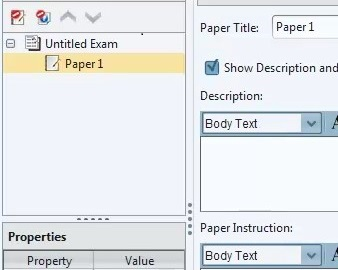
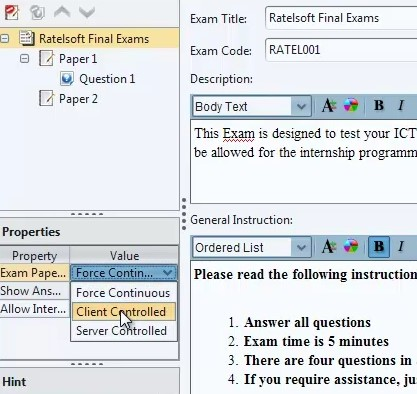

# The Exam

## Creating an Exam Project...
---
**The Exam Project Environment.**

> **TO START**.

- Click on `FILE` and create an Exam Project `NEW EXAM PROJECT`

- to reveal `UNTITLED EXAM` 

#### **Exam Properties and Settings**

**Exam Title:** Proposed name of Exam. e.g. *WAEC EXAM, RATELSOFT EXAMS, GTBank Tests *etc.

**Exam Code:** Should be unique for all examinee and should not contain characters outside the Alpha-numeric range.

**Exam Description and General Instruction:** Exam Instructions that show up for the examinee before start of exam.

> **EXAM PROPERTIES**

- ##### `Exam Paper Flow`:
For Exams with multiple papers, this determines the order of flow during examination.

There are currently 3 available options to choose from:

1. **Force Continuous** : Ensures that once a paper has been written the system brings up the next paper immediately.
2. **Client Controlled**: Examinee decides when to start a paper.
3. **Server Controlled**: Here the Exam manager decides when to start a paper.

- ##### `Show Answers After Exam`: YES or NO

- ##### `Allow Inter-Paper Navigation`: Allows the examinee/client to switch between multiple papers. It overrides the `Force Continuous` settings.

 > **Note**: You can save an Exam Project containing multiple exams but you can only export single exams into **The Manager** once at a time.
