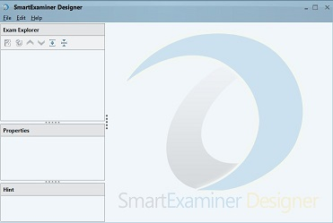

# The Exam
The Exam is the body of work that encapsulates an Exam Paper or Multiple Exam Papers with respective body of questions.
So here, we'llbe showing you how to create an Exam or Exam Project and how to set Exam properties to suit your Exam purpose.

#### Creating an Exam Project...
---
**The image below is the The Designer User-Interface.**

### The First Step

The very first step to building questions is to create an **Exam Project**.

1. Click on `File` 

2. From the resulting drop-down, Click on `New Exam Project`. This creates an `Untitled Exam` for you.
3. The page becomes active and ready for Exam customisation as shown below when you click on the `Untitled Exam`.

### The Second Step
**The next step is to fill the Exam Properties and Settings fields. Below are brief explanations of what the fields are for**

- **Exam Title:** 

This is visible to the end-user while taking the exam; it is more like the **name of the Exam**. e.g. *WAEC EXAM, RATELSOFT EXAMS, GTBank Tests *etc.

- **Exam Code:** 

The Exam Code should be unique for all the exams being imported into the Exam Manager and should not contain spaces or characters outside the Alpha-numeric range. e.g. *GTBTEST201, WAEC1998, JAMB2020.*

- **Branding Banner:** 

With the Designer, customers are allowed to imprint some level of their presence on the Exam, such that it is visible to their examinees while taking the exam. e.g. A School Logo, Company Banner, Military Insignia and Moto can all come into play here. 

- **Branding Colour:**

Establishments that have peculiar brand colour can choose their colours, this gives the examinee a familiarity feeling and an identity to the brand.

- **Exam Description and General Instruction:** 

The Exam Descriptions and Instructions must show up for the examinee before start of exam. So Whatever last minute Exam Instruction and Description are entered for the examinee.

> Note: The Exam Description and General Instruction fields must not be left blank, otherwise you won't be able to export the Exam you have created.

##### EXAM PROPERTIES

- **Paper Flow:**
For Exams with multiple papers, this determines the order of flow during examination.

There are currently 3 available options to choose from:

1. **Force Continuous** : In situations where there are multiple papers to be written by the examinee, this settings ensures that once a paper has been written the system brings up the next paper immediately. The System controls the Paper flow.
2. **Client Controlled**: The application which the Examinee takes Exams on is called the *Client*; so with this settings, the examinee decides when to start a paper.
3. **Server Controlled**: Here the SmartExaminer Manager decides when Examinees are to start a paper.

- **Show Answers After Exam: **

Often, formal examinations prefer setting this as `NO`, that is the Answers are not shownto the examinee after the exam is over. However, when mock exams or tutorials are being conducted with this, selecting a `YES` may be preferable.

- **Allow Inter-Paper Navigation:** 

Allows the examinee/client to switch between multiple papers. It however overrides the `Client Controlled` Paper flow settings.

 > **Note**: You can save an Exam Project containing multiple exams but you can only export single exams into **The Manager** once at a time.
  
  
  
  
 
  

