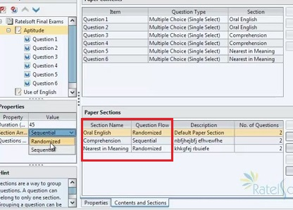

# The Paper

From a school's perspective, the **Paper** can be referred to as Modules, Courses or Subjects, etc. depending on what term it bears in your school.

_note: One can create multiple **Papers** under an **Exam**._

#### Creating an Exam Paper...

**First**

1. Click on `File` 

2. From the resulting drop-down, Click on `New Exam Project`. This creates an `Untitled Exam` for you.

3. Right click on `UNTITLED EXAM`, -note that at this stage, You may have renamed the 'Untitled Exam',- the dropdown reveals option to create `NEW EXAM PAPER`, click on it and a `Paper 1` is created.

4. Clicking on the `Paper 1` activates the Paper Properties from which you can edit and set feature preferences.

**The Exam Paper Environment.**

#### **Paper Properties and Settings**

- **Paper Title:**

This is the name of Paper/Subject the examinee is to write, and like the Exam name, it is also visible to the examinee. e.g. Use of English, Aptitude111, Math 101, Bio 201 etc.

- **Paper Description and Paper Instruction:** 

Unlike the Instruction and Description fields on The Exam Properties, this isn't compulsory, unless you check

- [x] `Show Description and Instruction before paper starts`.

##### Paper Properties

- **Paper Duration:**

This is the Time duration of the Paper in minutes. The minimum allowed time is 5 minutes >.

- **Section Arrangement:** 

Section Arrangement defines how the questions would be lined up or presented to examinees will taking the exam. i.e. if you wish the questions to flow in `sequence` or appear `randomly`. 

    (e.g. In The Use of English, If you have three sections listed in order 
    - 'Oral English' 
    - 'Comprehension' 
    - 'Nearest in meaning' 
    At a RANDOMIZED setting, the system gets to pick questions alternating in no particular order from the above listed sections. 
    However, When on a SEQUENTIAL setting, the questions will first come from 'Oral English', next from 'Comprehension' and finally from 'Nearest in Meaning'.)
    

    Clicking on the `Contents and Sections` tab at the foot of the page, reveals further settings which can be utilized to effect changes on the Paper Contents and Paper Sections.
    e.g. you can assign the number of questions to be answered from each section, while also deciding if the questions within a single section is randomized or sequenced.

- **Questions to Answer:** 

This defines the number of questions which examinees would be presented to answer while taking the Paper. 

This is most useful if you wish to allow questions to be selected randomly as a subset of a 'question bank'.
This means that there may be times when you have created or imported a pool of questions from which you would want examinees to answer from, desginating a specific number of questions to answer will ensure the systems presents just that to the examinee. 

    It is advisable to set this after all Questions have been created, this is because further question addition after selecting the number of **Questions to Answer** invalidates this settings, returning it to the total number of questions add to The Paper. 

#### To Import Questions from A File or Download Preset Questions

- To import or download questions, right click on the Exam `Paper` you have created to reveal a dropdown.

- Then Click on `Import Questions from File` or `Download Questions`.

- **Calculator Type:** 

Gives options to either allow or deny the use of calculator for each paper. Calculator types are Simple (for basic operations), Advanced (for scientific calculator operations) and Base (for Bin, Hex, Oct and Decimal operations).

- **Show Question Marks:** 

By default each question is assumed 1 mark, however you can allocate different marks to different questions. So, this feature controls the option to show the mark associated with each question while the examinee is taking an exam.
