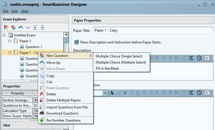
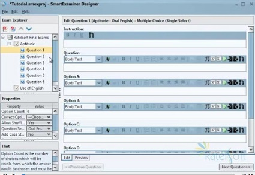
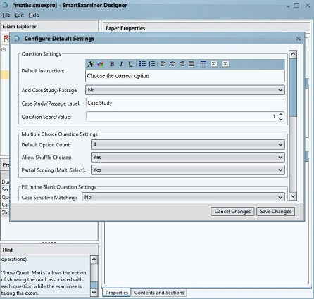
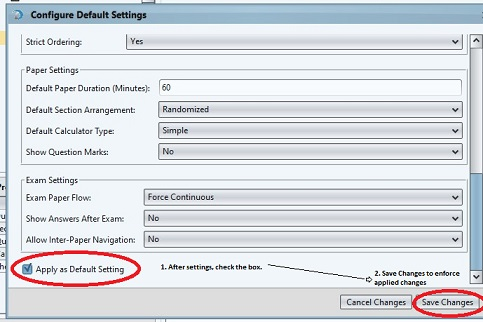
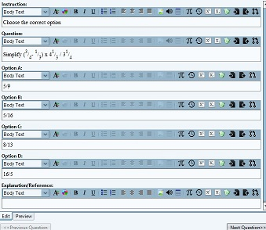
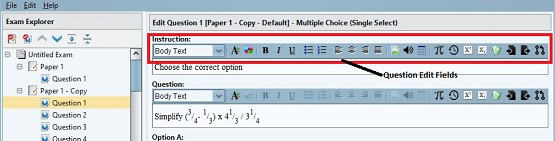
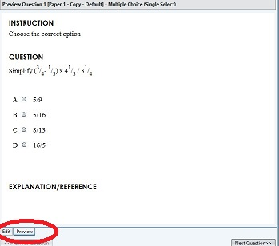

# Questions Design

## Creating Questions...

* * *

> **To Create Questions**.

- Open Designer App, Click on `FILE` and create an Exam Project `NEW EXAM PROJECT`

- Right click on `UNTITLED EXAM` choose `NEW EXAM PAPER` then `NEW QUESTION`

**The Question Environment.**

.

.

### **Paper Properties and Settings**

- **Option Count:** is the number of choices which will be visible from which the answer would be chosen and nust be between 2 and 10.
- **Correct Option:** the correct option.
- **Allow Shuffle Choices:** is a feature which can be set to randomly display the question options on the client App. As an example, if this property is allowed, Option A may appear on the client App as Option B, however, the correct answer is maintained.
- **Question Section:** A question must belong to a section and can only be in single section within a paper.
- **Add Case Study/Passage:** A Case Study/Passage can be added to this question. This can range from literature scripts to sample solutions/exhibits which could be used as a guide to answer the given question.
- **Question Score/Value:** is the mark assigned to the question. The default is 1 mark. For half mark, use 0.5

> **To Configure Default Question **

- Open Designer App, Click on `EDIT` then `CONFIGURE DEFAULTS`

.

> On the `Configure Default Settings` Page, There are several Settings available for use.

1. **Question Settings:**
     Add `Case Study/Passage`, `Passage Label`, `Question Score/Value`
2. ** Muliple Choice Question Settings**:
   `Option Count`, `Allow Shuffle Choices`, `Partial Scoring (multiple Select)`
3. **Fill in the Blank Question Settings**:
  `Case Sensitive Matching`, `Strip Spaces`, `Ignore Multiple Spaces`,`Partial Scoring`, `Strict Ordering`.
4. **Paper Settings**:
  `Duration`, `Arrangement`, `Calculator type`, `Show Question Marks`.
5. **Exam Settings**:
  `Exam Paper Flow`, `Show Answers After Exam`, Allow `Inter-Paper Navigation`.

*Note: Applying Default settings,by checking the box as shown in the above image, enforces and overrides some of the previous settings that may have been made on the Exam, Paper and Question Pages.*

### Questions Entry

This background is where you enter the Question, Question Options and Explanation/Reference if available.

*The Question edit panel red-marked above presents opportunities for configuring question fields. Hovering your mouse over them gives clues as to what property each icon signifies.*

##### The Question Edit Panel has features such as are present in The MircoSoft Word. Example -
Font Size

Colour

Bold

Italics

Unordered and Ordered Lists (Numbers and Bullets)

Word Alignment

Import image

Import Audio (For Audio Questions)

Create Tables

Insert Mathematical Symbols and Unicode Characters

Recall Most Recently used symbols

Make selected Text SuperScript or SubScript

Insert Sample Expression Templates (Such as Mathematical 
templates)

Import or Export Saved Raw Content

Pull Content from Previous (This comes in handy in 
comprehension questions, or when questions/informations are relevant to several sequnce of questions.)

*While entering questions, one can click on the `Preview` tab as shown on the above image to Preview. The click on `Edit` to go back to edit page.*

