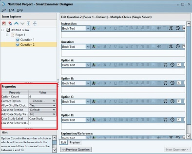
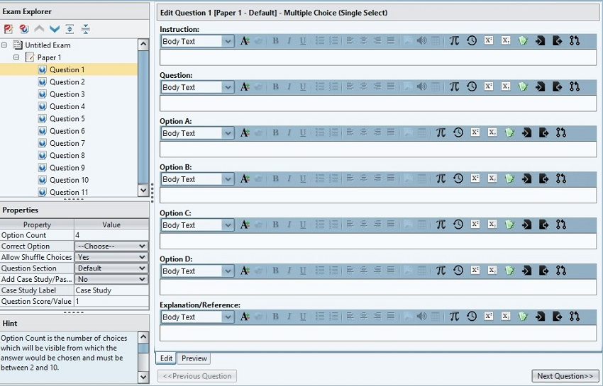

# Creating Questions
How to Create Exam Questions:

1. Click on `File` 

2. From the resulting drop-down, Click on `New Exam Project`. This creates an `Untitled Exam`.

3. Right click on `UNTITLED EXAM` and the dropdown reveals options to create a `NEW EXAM PAPER` 

4. Go ahead and create `Questions` by right clicking on the `Paper` or just clicking the **New Question** icon under the Exam Explorer.

At the moment there are three question types to choose from, Other types will be coming up in subsequent updates.
The available question types are:

- Multiple Choice (single select)
- Multiple Choice (multiple select)
- Fill in the Blank

### **Paper Properties and Settings**

1.  **Option Count:**
This defines the number of answer choices which will be visible from which the answer would be chosen and must be between 2 and 10.

2. **Correct Option:** 
This is the option bearing the correct answer.

3. **Allow Shuffle Choices:** 

This feature can be set to alternate and randomly display Question Options on the different client App. 
(For example, if this property is `allowed`, Option A may appear on another client/examinee's page as Option B, nevertheless, the correct answer is maintained regardless of what option it appears on.)

4. **Question Section:**

In a situation where Paper Sections have been created, this avails the opportunity to assign particular questions to a target Paper Section. question must belong to a section and can only be in a single section within a paper.
On how to create Paper Sections, refer to Paper Properties on 'Creating an Exam Paper' Page.

5. **Add Case Study/Passage:** 

A Case Study/Passage can be added to this question. This can be a sort of question guide just like a 'Comprehension' with which the examinee is required to read and answer more than a question originating from the script. It could also be literature scripts, sample problems/exhibits which could be used as a guide to answer the given question.
Therefore A Case Study often precedes a question or series of questions. So choosing `Yes` for Add case study, adds The Case Study field in question entry plane.

6. **Case Study Label:** 

The default title settings for the Case Study/Passage is Case Study, but The Case Study Label feature affords the opportunity to rename the desired Passage. So if it's a Comprehension, you can name it so at this point.

7. **Question Score/Value:**
is the mark assigned to the question. The default is 1 mark. For half mark, use 0.5

#### Configure Default Question 
This is necessary when you have series of questions that you need to follow a particular trajectory or pattern. Configuring this settings ensures you don't have to go to properties to input singular settings for the questions.

- Open Designer App, Click on `EDIT` then `CONFIGURE DEFAULTS`

On the `Configure Default Settings` Page, There are several Settings available for use, and we have explained each of the feature in the Paper and Question Properties. 

1.  **Question Settings:**
     Add `Case Study/Passage`, `Passage Label`, `Question Score/Value`
2.  ** Muliple Choice Question Settings**:
    `Option Count`, `Allow Shuffle Choices`, `Partial Scoring (multiple Select)`
3.  **Fill in the Blank Question Settings**:
    `Case Sensitive Matching`, `Strip Spaces`, `Ignore Multiple Spaces`,`Partial Scoring`, `Strict Ordering`.
4.  **Paper Settings**:
    `Duration`, `Arrangement`, `Calculator type`, `Show Question Marks`.
5.  **Exam Settings**:
    `Exam Paper Flow`, `Show Answers After Exam`, Allow `Inter-Paper Navigation`.

_Note: Applying Default settings, by checking the box as shown in the above image, ensures that every other question created follows the settings without affecting previous questions already set. The new setting may cut across the Exam, Paper and Question Pages. However, when the series of questions you need to conform to a the Configured setting has been entered and you wish to go back to default settings or Singular edit, simply go back to the Configure Default page and uncheck `Apply as Default Setting`._

### **Questions Entry**

The Question Entry Plane or field is where you build the Question, Question Options and Explanation/Reference if available.

_The Question edit panel red-marked above presents opportunities for configuring question fields. Hovering your mouse over them gives clues as to what property each icon signifies._

** The Question Edit Panel has features such as are present in The MircoSoft Word. Example -**

- **Body Text:** Refers to the style of the text, It's a body of text by default, but you have options to make the Text a paragraph, different headings, a quote, etcetera.

- **Font Size:** There are options to change the entered text to different sizes.

- **Colour:** One may want to change the texts to a particular colour, there are assorted ranges of colours to pick from.

- **Bold**

- **Italics**

- **Unordered and Ordered Lists (Numbers and Bullets)**

- **Word Alignment**

- **Import image**:
Ensure that the image being imported is not larger than 650 pixels. This is so that the image could show properly across all devices (PC or Mobile), and the image file cannot be greater than 500kb, this so that when the files are being downloaded by the web server it doesn't take so long.
You may need an editor to resize images that do not meet the above specifications.

Images can also be used within any of the edit fields - question,options, etc.
The imported image fields are also quite active, so you can right click on it and effect changes as allowed.

- **Import Audio (For Audio Questions):**
In situations where listening or audio questions and tests are required, this comes in handy. You can import audio files and input different available controls to ensure you get the best out of it.

Features such as Volume controls, options to make the audio Stoppable, Pausable or Seekable also enhances examiners usage options.

- **Create Tables**
Just like on Microsoft Word, you can build your tables, add rows and columns at wish. 

There are also ample table properties you can use to achieve desired result.

To edit or delet a table, the best approach wouldn't be to use a backspace or delete tab; rather, right click on the table's background, and click on `Table Proprerties` and then you can reconfigure or delete table properly.

- Insert Mathematical Symbols and Unicode Characters

- Recall Most Recently used symbols

- Make selected Text SuperScript or SubScript

- Insert Sample Expression Templates (Such as Mathematical templates)

- Import or Export Saved Raw Content

- Pull Content from Previous (This comes in handy in comprehension questions, or when questions/informations are relevant to several sequnce of questions.)

_While entering questions, one can click on the `Preview` tab as shown on the above image to Preview. The click on `Edit` to go back to edit page._
