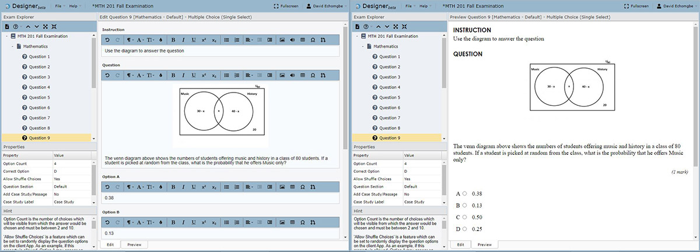
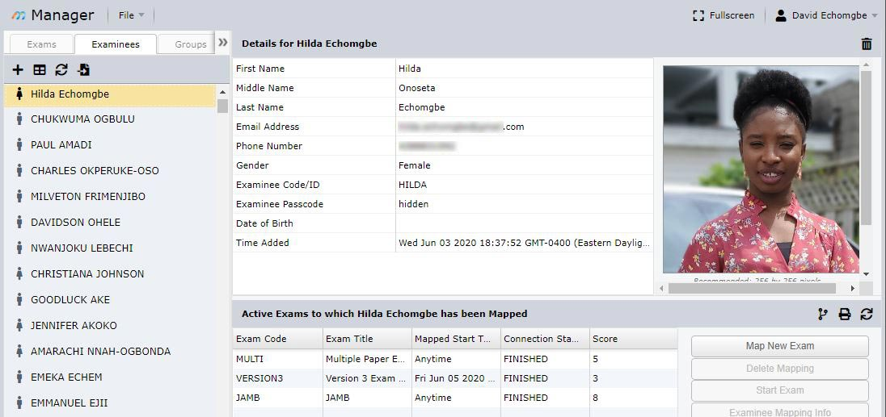
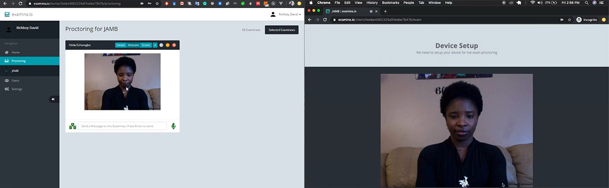
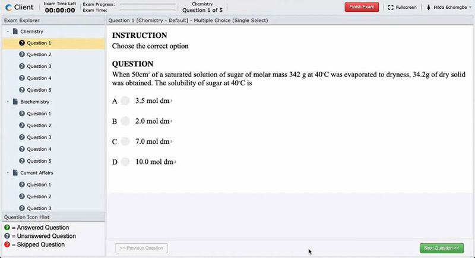

# Understanding examina.io

### Welcome to examina.io! 

This page gives you a general overview of the examina.io platform as well as SmartExaminer which is a compatible offline version and how each component application fits together. We further discuss several other parts of the platform and how they seamlessly bind to the default structure and existing workflow used in schools and organizations for handling tests and examinations.

## Introduction

examina.io and SmartExaminer were built for schools and organizations needing to host secure assessments with the highest integrity. Assessment processes can involve many stakeholders with different tasks and varying permissions and so it is important for exam CBT platforms to understand and respect them. 

Take a university as an example, a lecturer would normally be responsible for creating the test questions which should not be accessible to any other person until the assessment. The lecturer would also set the instructions and conditions for the assessment. In a well structured institution, for an exam, the lecturers create their exam questions and submits the questions to the department in charge of handling and conducting examinations. This department would organize the location and time as well as those responsible for invigilating the exam. For a midterm test, however, the lecturer could be responsible for the handling and could be joined with teaching assistants.

examina.io was built to natively fit into such a setup, allowing each stakeholder to continue working as they were without any change in responsibility. 

The following sections discusses several apps and concepts available on examina.io and how they could be used to achieve the assessment goals of your organization.

## The Designer

The Designer is the application where the test questions are created. This application is available online and offline and can be installed by anyone. In our school scenario, a lecturer would create the exam questions using the designer and can set a number of properties including the duration of the exam, the question type and the mark assigned to each question, the number of options in each question and the section groups, etc. There are several options available to allow more customization and flexibility.

The Designer has several question types available (*more under development*) and also supports importing questions from text files to further simplify the process.

*A sample Exam being created on the online Designer, showing question Edit and Preview windows.*

After creating the exam question, the exam file can be exported from the designer. The questions are encrypted when the file is being generated. The file can then be forwarded to the department responsible for handling the examinations. In the case that the same person is responsible for organizing the examination, the file can be imported to the manager for the exam administration.

## The Manager

The Manager is at the center of it all. After creating the questions from the Designer, the exam file needs to be imported into the Manager.

The Manager is the application where the Exam date and time is configured as well as the Examinees who would be sitting for the exam. This application would normally be used by the department responsible for exam scheduling and/or support IT staffs. Minimal permissions can be granted for specific examinations to lecturers and their teaching assistants as well as anyone who may need access. 

> **Examinees** are the applicants/students who would be writing the exams.

Several examination and invigilation settings such as Live Exam Proctoring, eFace ID verification and Exam visibility can be configured on the Manager. Emails can also be sent to Examinees with information about their exam time and login credentials as well as exam result after the exam (*if needed*).

## The Proctor

The Proctor application is for exam invigilators and must be explicitly enabled on the Manager for each exam that requires it. Users can be created with invigilator permission to grant them access to only the invigilation environment for exams. 

The Proctor application allows examinee monitoring to ensure that the exam is conducted under the required condition. The invigilator must grant access to an examinee before the exam can be started. Before granting permission, the invigilator can request that the examinee show around their environment for verification.

The invigilator receives video streams from the examinee webcam and screen as well as audio stream from their microphone and can monitor these streams for the duration of the examination. The invigilator can choose to enable their own microphone to speak directly with an examinee and/or send a notification message.

## The Client

The Client is the application which the examinees would use to take the exam. The exam link would normally be sent to the examinees via email to notify them of their exam time and possibly their login credentials (*if needed*).

If an exam has been configured to use eFace ID verification, the examinee would be pre-verified using facial recognition with existing photograph of the examinee that was added on the Manager application.

The client application automatically saves the state of the exam every 90 seconds in case of some unforseen circumstances like power failure.

## API Endpoints

Our API allows organizations to integrate with examina.io using RESTful endpoints. This brings more flexibility as it allows institutions to merge examina.io into their existing workflow. 

Webhooks can also be added to receive notifications when examinees are through with their exams and results are available.

Together with the API endpoint, the Client application can be embedded as a widget on the organization's website with autologin enabled to by-pass additional login.

## Circles

Circles are units of permissions that are made up of Users, Exams and Examinees. Circles allow you to define a grouping that grants users explicit access to Exams and Examinees in that circle. 

In a school setting for example, a Circle can be created for a course with all the assessment for that course added as Exams and the students that are registered for the course can be added to the circle as Examinees. Lecturers, Teaching Assistants and Invigilators can be added as Users. Invigilator account can only be used for proctoring.

This ensures that Users can only perform actions where they have been granted permission.

## Conclusion

examina.io is inherently distributed, allowing organizations to retain their existing workflow processes while delivering secure assessments. Each stakeholder in the organization already has a defined job description which should be respected. examina.io ensures that the stakeholders are given the adequate permissions necessary to carryout their duties effectively and their defined job descriptions are well respected. 

